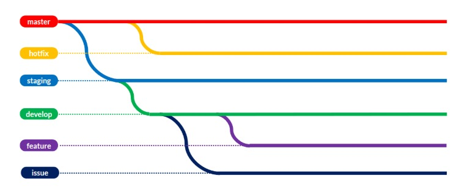

# Curso Git y Github 2025
## Tabla de contenidos
1. [¿Qué es markdown?](#qué-es-markdown)
2. [Clase 1](#clase-1)
    - [Introducción a Git]
    -
    -
    -
3. [Clase 2](#clase-2)
4. [Clase 3](#clase-3)
5. [Clase 4](#clase-4)
6. [Clase 5](#clase-5)
7. [Clase 6](#clase-6)
8. [Clase 7](#clase-7)
9. [Clase 8](#clase-8)
10. [Comandos escenciales](#comandos-escenciales)
11. 

# Qué es markdown?   
Lenguaje de marcado ligero y sencillo que permite dar estilo a un texto sin usar html.


# Clase 1
## Introduccion a Git
### Que es un control de versiones?
Sistema de registro de cambios en el codigo fuente de un proyecto. Permite tener un historico de cambios y quien los hizo
>Ej. Un checkpoint de un juego

#### Importancia:                
- Rendimiento, solo se guarda lo necesario (solo copia cambios)
- Seguridad, conserva toda acción (cambios y quienes lo hicieron)
- SSH -> Firma digital que permite verificar la identidad
- Flexibilidad, no es necesario un desarrollo lineal. Se pueden hacer cambios "paralelos" en equipo
## Que es Git?
Es una herramienta de **control de versiones**. Al  ser un sistema distribuido aloja una copia del repositorio en cada maquina local y se puede tener uno o varios repositorios remotos.

Nos permite trabajar colaborativamente
## Que es un repositorio?
Carpeta donde se almacenan ficheros de un proyecto. En el repositorio hay notas que indican el cambio realizado
Pueden ser locales (nuestro ordenador) o remotos (servidor externo)

> **Nota:**
>Git es sensible a los cambios de salto de linea diferentes entre linux y windows ya que los detecta como modificaciones al momento de hacer un commit (LF y CRLF)
Se debe configurar correctamente

## Iniciar un proyecto en Git
Inicializa un repositorio de git vacio en la ruta en la que estás y crea una carpeta .git

```
$ git init nombre-proyecto
$ cd nombre-proyecto
```

Alternativa:

```
$ git init nombre-proyecto --initial-branch=main
```

# Clase 2
## States y commits
- ### Modified
    Cuando un archivo se crea, elimina o tiene cambios no confirmados
- ### Staged
    Área temporal transitoria : Archivo marcado listo para ser confirmado en el repositorio local. En esta area de **staged** van todos los archivos que queremos agregar nuestro commit.

    - Identifica los archivos modificados

         

    - Despues de un `git add <archivos>` los archivos especificados pasan al estado staged

        
    
- ### Commited
    Los cambios son confirmados y grabados en el repositorio.

## Qué es un commit?
>Ej. Checkpoint de un videojuego

Es como un punto de restauracion, guarda el avance en un determinado punto de tiempo. Muestra los archivos en el momento que se hizo fecha autor.

### Cómo crear un commit:
```
$ git commit 
$ git commit -m "mensaje"
```
> **Nota:** Se puede crear un archivo `.gitignore` donde poner archivos que nunca se enviara al repositorio remoto (para guardar contraseñas, etc). Si se modifico algo en el `.env` despues de ponerlo en el `.gitingore` se tiene que borrar el `.env`, volver a crearlo y ponerlo al `.gitignore`. Se debe borrar en todas las "maquinas" en caso de trabajar de forma colaborativa para evitar errores

## ¿Qué es el HEAD?
Indica dónde te encuentras. Solo puedes estar en un lugar es decir el Head 

Referencia el punto actual del historial de cambios en el que se está trabajando
`HEAD -> main`
>Verificar con `git log`

## ¿Qué es una rama en git?
Puntero a un commit especifico (snapshot del proyecto en un momento dado). Son bifurcaciones del código


> **Nota:** La rama main solia llamarse master

## ¿Para qué sirven las ramas?
- Evitar pisar el avance de otro en modo colaborativo
- Permite trabajar de manera colaborativa (no es lineal)
Cada quien trabaja en una rama diferente y posteriormente las ramas vuelven a la rama `main`

## Crear una primera rama
Las ramas que creamos siempre son en base a nuestro ultimo commit y son independientes de otras.
### Crear rama
```
$ git branch <branch>
```
### Cambiar de rama
```
$ git checkout <brach>
$ git switch <branch>
```
### Comando para crear y cambiar de rama
```
$ git switch -c <branch>
```
> No se pueden crear ramas con el mismo nombre.

### Tener en cuenta
- Al crear la rama `(HEAD -> branch, main)` esto se debe a que las ramas son apuntadores y ambas ramas estan en el mismo nivel.
- Al hacer el primer commit dentro de la rama `(HEAD -> branch)` y la rama `main` sigue apuntando al commit anterior.
- Al hacer un commit en la rama `main` despues de la creacion de una rama ya no se visualiza el commit al que apunta.


# Clase 3
## Fusionar ramas
Al fusionar, el codigo de una rama se asimila en otra.

Se usa `git merge`, se le indica a que rama queremos aderir la rama en la que nos encontramos. Al ejecutarlo, se crea un commit que incluye todos los cambios de la rama origen a la rama actual.

> **Commit de fusión:** `Merge branch <branch>`

#### ¿Qué es un fast forward
Ocurre durante una fusión (merge) cuando la rama de destino no ha tenido nuevos commits desde que se creó o actualizó la rama de origen. En ese caso, Git puede simplemente mover el puntero de la rama de destino al último commit de la rama de origen, sin crear un nuevo commit de fusión

### Modificando el mensaje del commit
- Abre el editor antes de hacer el commit
    ```
    $ git merge --edit
    ```
- Evita que haga commit automaticamente
    ```
    $git merge --no-commit
    ```

Al hacer `git merge` no solamente crea el commit de la fusion, tambien trae todos los otros commits.
## Eliminar ramas ¿Por qué?
Es buena práctica y para mantener el codigo limpio
### Comandos para eliminar ramas
```
git branch --delete <branch>
git branch -D <branch>
git branch -d <branch>
```

## Comando: git rebase
Tiene el mismo efecto que `git reset -hard`
Por ejemplo, si se tienen varios commits, al usar `git rebase` los convierte en un solo commit

## Conflictos en Git 
Cuando Git no es capaz de determinar el cambio que tiene que prevalecer al hacer una fusion, surge un conflicto.

Es común tener conflictos al intentar fusionar ramas que hacen cambios en el mismo archivo.

### Resolver conflictos


Dado un conflicto indica:         
```
$ git diff
```
- Cual es el conficto
- Qué esta produciendo el conflicto
- En qué archivo
- Formato de error

Los errores se pueden arreglar en el editor de compilacion eligiendo si se quiere aceptar uno, ambos cambios o ninguno

# Clase 4
## GitHub
Servicio de alojamiento en la nube para control de versiones. 

## Repositorio remoto
Los repositorios remotos son versiones de tu proyecto que están hospedadas en un servidor. Sirve como punto de sincronización entre repositorios locales.

### Gestion de proyectos


### GitHub Actions
Plataforma de CI/CD (Integración Continua/Despliegue Continuo) que permite automatizar el flujo de trabajo de desarrollo de software en GitHub. Permite compilar, probar e implementar código directamente desde tu repositorio de GitHub creando flujos de trabajo personalizados. 

### Organizaciones
La gente añadida a la organizacion tiene visibilidad de todos los repositorios de la organización

## Enlazar repositorio local con el repositorio remoto
```
$ git remote add origin <URL.git>
```
### Si es un repositorio ya existente
```
$ git clone <URL.git>
```
> `git@github.com:nombre/repo.git` para clonar con direccion SSH
### Generar key SSH
Se usa para protenger el repositorio y proteger tu identidad.

## Actualizar repositorio local
Primero se usa `git fetch` para actualizar las **referencias** de las ramas el repo remoto, luego te mueves a la rama y recien se visualiza en el local y hacer un `git pull`. Esto se hace para evitar hacer `git pull` de una rama en rama ej. main.
```
$ git fetch
```
### Comando para eliminar ramas
Si se elimina una rama desde github en el repo local aun existe la referencia. El comando actualiza las referencias de las ramas del repo remoto. (Borra)
```
$ git remote prune origin
```

## git push, git pull y pull request
Son tipos de fusiones
## git push
Empuja cambios del repo local al repo remoto. Debe subir ramas existentes.
```
$ git push <alias> <rama>
```
### Comandos de git push
`$ git push -u origin <branch>`: El `-u` hace una coneccion entre el local y el remoto. Se hace para cada rama para usar `git push` directamente
 
`$ git push origin <branch1><branch2><branchN>`: Empuja ciertas ramas en particular

`$ git push --all`: Actualiza todas las ramas en su referencia adecuada

`$ git push -force <nombre-remoto><rama-remota>`: Peligro: Sobreescribe el historial de commits locales con los del repo remoto

`$ git push -d origin <branch>`: Eliminar ramas
## git pull
Descargar cambios del repo remoto al local.
```
$ git pull <alias> <rama>
```
### Comandos de git pull
`git pull --set-upstream origin <branch>` : enlazar remoto con local

`git pull --all` : traer todos los cambios.

`git pull origin <branch1><branch2><branchN>` : todos los cambios a una sola rama

### Conflictos en pull y push
Cuando la rama a la que hacemos pull hizo cambios en las mismas lineas que el local.

## ¿Qué es un Pull Request?
Peticion de cambios que se envia al repositorio original. Pedir una revisión.
### ¿Cómo se hace?
Tenemos que subir nuesta rama `git push` y luego hacer el PR 

|      Opción 1                 |      Opción 2       |
|-------------------------------|---------------------|
|           ||

Cuando se crea una PR muestra los commit de la rama, las revisones hechas, y cambios en los archivos. Una vez aprobado el PR se fucionan las ramas
### Tips
#### Crear PR
1. Hacer una PR pequeña de algo específico
2. Explicar el PR usando los recursos que se tiene
#### Revisar PR
1. Feddback positivo
2. Ser claros y concretos
3. Entender el contexto, se ponen parches y aunuqe el codigo no sea bonito es funcional.

# Clase 5
## ¿Qué es un GitFlow?
Forma de usar Git de un equipo al trabajar de manera colaborativa. Se siguen pautas

## Git Flow
1. **main (master):** Contiene el codigo visible
2. **develop:** Código a ser probado y validado
3. **Feature:** Características nuevas
4. **Realease:** Cambios de ultimo momento
5. **Hotfix:** Arreglar bugs pequeños
|

## GitHub Flow
Rama **main** y cualquier otra rama, usualmente `features`, que quiera ser integrada a la rama principal por medio de una pull request. Es más simple.
> **CI/CD:** Integracion continua y despliegue continuo. (recomendado)


## Trunk Based Development
Rama **main** y ramas auxiliares efímeras integradas con PR. 
Es obligatorio contar con CI/CD.


## Ship/Show/Ask
1. **Ship:** Se fusiona en la rama principal sin revisión.
2. **Show:** Abre una PR, si pasan la revision de CI se fucionan directamente. No estoy totalmente seguro del cambio, quiero quwe el equipo lo vea.
3. **Ask:** No se si esta bien el cambio, solicita revisión. Discusión y feedback antes de fusionar.
### Reglas
1. Buen sistema CI/CD pero no es obligatorio
2. Confiamos en el equipo, cada uno es responsable de la categoria del cambio y existen buenas practicas.
3. Las revisiones de codigo no son obligatorias
4. Ramas que salen del main son pequeñas y de vida corta.
5. El equipo confia en los demás

# Clase 6
## Buenas Practicas en Git
### Función
- Es un estándar
- Resolver conflictos más facil
- Historial de commit legible

### 1. ¿Cada cuanto hacer commits?
Se hacen commits pequeños a menudo. No significa hacer commits sin sentido
### Escribir buenos commits
- Usar verbos en presente: `add`, `change`, `fix`, `remove`
- No se siguen reglas de puntuacion
- Deben estar en minuscula
- Maximo 50 caracteres (en el cuerpo se puede alargar)
- Usar utilidades
- Usar prefijos

```
<tipo-de-commit>[scoope]: <descripcion>
```

#### Prefijos
- **feat:** Nueva caracteristica para el usr.
- **fix:** bug que afecta al usr.
- **perf:** cambios que mejoran rendimiento.
- **build:** cambios en el sistema de build, despliegue o instalacion.
- **ci:** cambios en la integracion continua.
- **docs:** cambios en la documentacion.
- **refactor:** refactorización del código.
- **style:** cambios de formato, tabulaciones, espacion o punto y coma, etc.
- **test:** tests o refactorización de uno ya existente

> Podemos crear nuestros propios prefijos

### Escribir un buen nombre de rama (sugerencias)
- Ser consistente con los nombres `prefijo/accion`
- Usar nombre de la acción a realizar en la rama
- Usar IDs de JIRA o sistema de tickets 


# Clase 7
## Deshacer cambios
### ¿En que casos deshacemos cambios?
- Deja de funcionar 
- Recuperar codigo eliminado
- Recuperar archivos eliminados

## Comandos destructivos y no destructivos
- **Destructivo:** Afectan el historial de commits realizados.
- **No destructivo:** Trabajn en base al historial sin afectarlo.

>Ej. `git rebase` es un comando destructivo.
##  git reset y git revert
Para usar estos comandos hay que saber los cambios hechos en los commits que vamos a usar.
```
$ git show <id>
```
### git reset
Te devuelve a un checkpoint anterior y borra lo de adelante. Es un comando **destructivo**
- **soft:** Mantiene los cambios que ocurrieron antes de hacer commit.
- **hard:** Descarta todos los cambios.

#### hard
Resetea los cambios, lo deja como estaba en el commit elegido antes de hacer los commits posteriores.

```
git reset --hard <id-del-commit>
``` 

#### soft
Elimina el commit pero los cambios se mantienen. Mantiene el estado de modiffied.

```
git reset --soft <id-del-commit>
``` 

> Ej. Si usamos `git reset` ya sea hard o soft para "arreglar" un commit y luego volver a hacer el commit este tendra un `id` distinto. Similar a `git commit --ammend` (técnicamente se borra el commit y se crea uno diferente)
 
#### Usar comando `git reset <id>` 
No actua ni como soft ni como hard, no esta en estado modiffied y los cambios se mantienen.

### git revert
Revierte los cambios de un commit y crea uno nuevo con los cambios revertidos. No borra commits, es un comando **no destructivo**, por lo que pueden surgir conflictos al trabajar sobre el mismo archivo.

Solo afecta a los cambios del `padre` del commit indicado. Devuelve al **padre**  del commit (el commit anterior)

#### Comando para cancelar revert
```
$ git revert --abort
```

> Se puede usar para el merge y para el pull

### git checkout
Recupera codigo específico de commits. Puedes ingresar a un commit pasado y agarramor la modificacion que necesitas.


```
$ git checkout <id>
```
### Comando: `git reset --hard HEAD~<N>` 
> HEAD: es un puntero. 

Si quiero hacer cambios aun punto anterior, modifico el commit al que HEAD apunta.
N → desde la posicion actual del HEAD cuantos quiero recorrer.

### Borre mi historial de comandos
Hice un `git reset` al primer commit de todos

`git reflog` → log de como se fueron cambiando el historial de commits (solo los muestra)
 
 #### Solución en caso de tener los cambios en la nube
 ```
 $ git pull origin main
 ```


# Clase 8 
## Hooks, Alias y Trucos de Git
### Hook
Automatiza la ejecutación de una accion `(bash, pearl, python, etc)` cuando ocurre una acción determinada en Git. Más usado del lado cliente que del servidor.
#### Hooks del lado del cliente
Solo afectan a su repositorio local
- **pre-commit** se ejecutan antes de un commit
    - Comprobar si se hacer commit de varios archivos (que no sean más de 5)
    - Ejecutar el linter sobre archivos modificados (podrias estandarizar todo el codigo)
- **prepare-commit-msg:** al momento de escribir el mensaje se puede modificar.
- **commit-msg** Comprobar el mensaje
- **post-commit** Notificar por Slack acerca del commit
- **pre-push** Ejecutar bateria de tests
- **post-checkout y post-merge** Limpiar directorio de trabajo (ramas etc)
#### Hooks del lado del servidor
- **pre-receive** Antes de que un push haga efecto
    - Comprobar commits bien formados
    - Verificar permisos del usr que quiere guardar commits 
- **update** Evitar de forma granular las actualizaciones
- **post-receive** 
    - Enviar correo a todos los usr que han grabado cambios
    - Reflejar en una UI referencias, ramas o commits nuevos

### Creando un Hook
Crear un archivo con el **nombre de la acción** `nombre-del-hook` en la carpeta `.git/hooks`, aqui va el codigo a ejecutar `(bash, node, pearl, python, etc)`. De otro modo Git no reconoce el hook.
## Alias
En lugar de usar los nombres de comandos completos se pueden definir abreviaciones.
### Crear un alias
```
$ git config --global alias.[nombre-del-alias] "comando a ejecutar"
```
> El nombre del comando se anota sin las comillas 
### Eliminar un alias
```
$ git config --global --unset alias.[nombre-del-alias]
```
## Trucos en Git
### Guarda tus cambios temporalmente
En caso de querer cambiar de rama cuando aun no se termino una tarea para hacerle un commit. 

Se puede revisar con `git stash list` y limpiar la lista con  `git stach clear`
Solo funciona sobre archivos a los cuales la herramienta de **git ya les esta dando seguimineto**.

- `$ git stash`
- `$ git stach -u`: se usa para considerar los archivos nuevos creados.
- `$ git stach pop`: Cambiar los cambios de una rama a otra (puede traer conflictos).

### Aplicar cambios de commits en especifico
Es una forma de fusionar cambios de cambios en commit especificos.
```
git cherry-pick <SHA>
```


> **Nota:** No se puede usar en un archivo que existe en la rama pero en el main no (rama destino). 

### Detectar qué commit es el que ha introducido un bug
Es similar a la busqueda binaria en elementos ordenados. Indicar un commit funcional y donde hay error. Busca el commit donde se introdujo el problema 
- `git bisect`: paso inicial
- `git bisect start`: indicar commit funcional
- `git bisect bad`: commit con conflicto. Descarta lo de arriba
- `git bisect good`: indicar buen commit. Seguir indicando si es buen o mal commit.
- `git bisect reset`
> Repito hasta que me indique el commit que introdujo el bug.


### Comando: Cambiar el nombre de un commit
- `$ git commit --amend -m "mensaje"`: "renombrar" el texto del commit realizado pero cambia el identificador
### Comando: Traer un archivo en concreto de otra rama o commit
- `git checkout <SHA> <archivo>`
### Comando: Copiar un archivo en concreto de una rama a otra
- `git checkout <nombre-rama-origen> -- <ruta/al/archivo>`


# Comandos escenciales
-  `comando && comando` -> se pueden concatenar dos comandos

- `$ git init nombre-proyecto`: inicializar nuevo repositorio en el directorio actual

- `$ git status`: muestra si existe algun archivo modified

- `$ git add .`: mueve todos los archivos modificados al area estado staged

- `$ git add <file>`: pone en el area staged solo los archivos seleccionados

- `$ git commit`: crea un commit sobre el archivo

- `$ git commit -m "mensaje"`: hacer un commit directamente en el bash

- `$ git restore --staged <file>`: quita archivos del area de staged

- `git log`: para ver los commits realizados con id, fecha, nombre, correo y nombre del commit

- `git log --oneline`: solo nombre e identificador del commit

- `$ git commit --amend -m "mensaje"`: "renombrar" el texto del commit realizado pero cambia el identificador

- `git checkout`

- `git rm --cached <archivo_a_ignorar>`: en lugar del .gitignore

- `git remote`: muestra el alias

## Comandos para ramas
- `git branch` listado de ramas

- `git branch <branch>`: crear rama

- `git branch -a`: permite visualizar todas las ramas incluyendo ramas de la nube del (repositorio remoto)

- `git switch -`: intercala entre dos ramas

- `git switch <branch>`: Cambiar de rama

- `git switch -c <nombre-branch>`: Crea una rama y cambia a esta inmediatamente

- `git checkout <brach>`: Cambiar de rama

- `git merge <branch>`: hacer fusion

- `git merge <branch> --no-ff`: se crea el commit apesar de que era posible hacer un ff

- `git merge --abort`: cancelar merge

- `git branch -D <branch>`: eliminar ramas (forzando) aunque no esten merged

- `git branch -d <branch>`: eliminar ramas evitando borrar ramas sin merged

- `git log --oneline --graph`: muestra donde se ha hecho los commits que implican una fusion 

- `git branch -a | grep <prefijo>`: listar ramas con el prefijo mencionado.

## Comandos git pull y git push

- `$ git branch -a`: Aparecen de blanco las ramas locales y de rojo las ramas del repo remoto (alias)

- `$ git remote -v`: Comando para listar los alias y el URL al que apunta

- `git config`: Se debe configurar el nombre, gmail de github y nombre de usuario

- `$ git fetch`: Actualizar referencias de ramas del repo remoto al local

- `$ git push <alias> <rama>`: Debe subir ramas existentes

- `$ git pull`: Comando para traer cambios de otras personas.


# Links de referencia
Descargar Git para Windows: [Windows](https://git-scm.com/download/win)

Descargar Git para Linux: [Linux/Unix](https://git-scm.com/download/linux)

Documentación completa de Git en: [Documentación de Git](https://git-scm.com/doc)

Tutoriales: [Vídeos](https://youtu.be/vlCXdvcgiE0?si=60-9A4zgzLO3YLdW) - Tutoriales en vídeo

Mi inspiración: [Vídeos]() 


